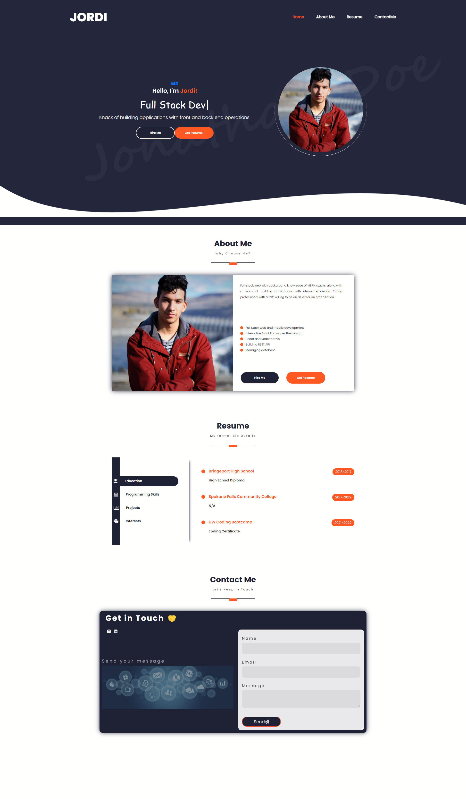

# That Chicano Dev!


# Deployed Heroku/Github
[Heroku](https://that-chicano-dev.herokuapp.com/)

[GitHub Repo](https://github.com/hernajor133/That-Chicano-Dev)

## About

Thhis portfolio is my best one yet and shows my knowledge and skill of react js.

## User Story

```md
AS AN employer looking for candidates with experience building single-page applications
I WANT to view a potential employee's deployed React portfolio of work samples
SO THAT I can assess whether they're a good candidate for an open position
```

## Screenshot


### `npm run build`

Builds the app for production to the `build` folder.\
It correctly bundles React in production mode and optimizes the build for the best performance.

The build is minified and the filenames include the hashes.\
Your app is ready to be deployed!

See the section about [deployment](https://facebook.github.io/create-react-app/docs/deployment) for more information.
WHEN I load the portfolio THEN I am presented with a page containing a header, a section for content, and a footer WHEN I view the header THEN I am presented with the developer's name and navigation with titles corresponding to different sections of the portfolio WHEN I view the navigation titles THEN I am presented with the titles About Me, Portfolio, Contact, and Resume, and the title corresponding to the current section is highlighted WHEN I click on a navigation title THEN I am presented with the corresponding section below the navigation without the page reloading and that title is highlighted WHEN I load the portfolio the first time THEN the About Me title and section are selected by default WHEN I am presented with the About Me section THEN I see a recent photo or avatar of the developer and a short bio about them WHEN I am presented with the Portfolio section THEN I see the developer’s applications. WHEN I am presented with the Contact section THEN I see a contact form with fields for a name, an email address, and a message WHEN I move my cursor out of one of the form fields without entering text THEN I receive a notification that this field is required WHEN I enter text into the email address field THEN I receive a notification if I have entered an invalid email address WHEN I am presented with the Resume section THEN I see a link to a downloadable resume and a list of the developer’s proficiencies WHEN I view the footer THEN I am presented with text or icon links to the developer’s GitHub and LinkedIn profiles.